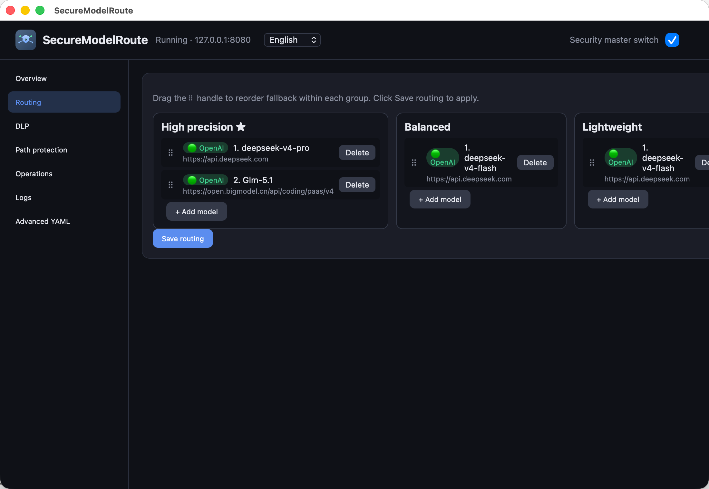

# SafeRoute

**A safe route to LLM intelligence—and a stable, faster path to get there.**

SafeRoute is a lightweight local proxy for OpenAI- and Anthropic-compatible clients. Point your IDE, agent, or SDK at `http://127.0.0.1:8080/v1` instead of a vendor endpoint directly. You get **fast fallback routing** across model tiers, plus **essential guardrails** for sensitive data and risky tool calls—without changing your application code.

**中文文档:** [README.zh-CN.md](README.zh-CN.md)



---

## Why SafeRoute

| | |
|---|---|
| **Route** | Ordered fallback across `high` / `medium` / `low` groups. Automatic retry on upstream errors, bad JSON, or missing stream tokens. OpenAI ↔ Anthropic conversion built in. |
| **Fast** | Small Rust core, local hop, streaming-native. One config file, hot reload, optional tray app that stays out of your way. |
| **Safe** | DLP for secrets and file corpora, operation rules on tool fields, path protection for critical files—toggle everything from one master switch. |

> One line in your client config. One local process. Smarter paths to the models you already use.

---

## Quick start

```bash
chmod +x scripts/install.sh
./scripts/install.sh --all     # CLI + tray app + login autostart

securemodelroute               # open admin UI
```

**Windows:** `.\install.ps1 -All` then `securemodelroute`

**Client config:**

```python
from openai import OpenAI
client = OpenAI(base_url="http://127.0.0.1:8080/v1", api_key="dummy")
```

| Endpoint | Purpose |
|----------|---------|
| `http://127.0.0.1:8080/v1` | OpenAI-compatible API |
| `http://127.0.0.1:8080/v1/messages` | Anthropic Messages API |
| `http://127.0.0.1:8080/ui` | Web admin |
| `http://127.0.0.1:8080/health` | Health check |

Optional headers: `X-SMR-Fallback-Group` (`high` \| `medium` \| `low`), `X-SMR-Session-Id` (SessionGuard + audit).

---

## Features

### Model routing

- Three fallback tiers with drag-and-drop ordering in the admin UI
- Per-request group override via header
- Streaming-aware fallback until the first content token
- Protocol detection and cross-vendor request/response mapping

### Data safety (DLP)

- **Content rules** — full-text or fragment match for secrets, phrases, extensionless sensitive strings
- **File rules** — disk-backed index (Bloom + SQLite + byte verify) for large corpora; incremental rebuild on file changes
- **SessionGuard** — when a tool mentions a protected file, redaction continues for the next *N* requests (`trigger_window`)
- Built-in credential presets (`sk-`, `AKIA`, `ghp_`, …) optional

### Operation safety

- Inspect tool-related fields on **requests and responses**
- `observe` (log only) or `enforce` (block)
- Rules by `command_exec`, `api_call`, `network_access` + keywords

### Path protection

- `deny_delete` / `deny_modify` / `deny_access` on paths; directories cover descendants

### Operations

- Web admin at `/ui` (English / 中文)
- Optional Tauri tray app (macOS / Windows)
- SQLite audit log and live security events
- Traffic body snapshots for debugging (optional, up to 20 MiB per file)

Master switch: `pipeline.security_enabled` (also in the UI header).

---

## Configuration

Example: [`config/smr.example.yaml`](config/smr.example.yaml)

```yaml
server:
  listen: "127.0.0.1:8080"
  default_fallback_group: high

pipeline:
  security_enabled: true
  dlp_enabled: true
  operation_security_mode: enforce   # observe | enforce

fallback_groups:
  high:
    - id: primary
      base_url: "https://api.openai.com/v1"
      model: "gpt-4o-mini"
      api_key_env: OPENAI_API_KEY
      timeout_secs: 120
    - id: fallback
      base_url: "https://api.anthropic.com/v1"
      model: "claude-sonnet-4-20250514"
      protocol: anthropic
      api_key_env: ANTHROPIC_API_KEY
```

**Config paths**

| Platform | Typical location |
|----------|------------------|
| macOS / Linux (install script) | `~/.local/etc/securemodelroute/smr.yaml` |
| macOS / Linux (direct `smr`) | `~/.config/securemodelroute/smr.yaml` |
| Windows | `%APPDATA%\securemodelroute\smr.yaml` |

Override with `SMR_CONFIG`. Prefer `api_key_env` over inline keys.

**File DLP index:** `{config_dir}/file-index/{rule_id}/` — see [README.zh-CN.md](README.zh-CN.md) or legacy docs for index layout details.

**Traffic snapshots (debug only):**

```yaml
logging:
  save_traffic_bodies: true
  traffic_max_body_bytes: 20971520   # 20 MiB cap
```

Files: `{config_dir}/traffic/*.body`

---

## Admin UI

Open `http://127.0.0.1:8080/ui` — overview, routing, DLP, path rules, operation rules, logs, full YAML editor.

| API | Description |
|-----|-------------|
| `GET /api/status` | Listen address, security flags, index readiness |
| `GET/PUT /api/config` | Read/write config; PUT hot-reloads |
| `GET /api/traffic` | Traffic snapshot list |
| `GET /api/traffic/{id}` | Full snapshot body |
| `GET /api/events`, `/api/audits` | Events and audit rows |

---

## Development

```bash
cargo test && ./scripts/verify.sh
cp test_model_api_key.example.txt test_model_api_key.txt   # gitignored; for live tests
./scripts/run_all_tests.sh
```

Implementation notes: [TODO.md](TODO.md). Previous README snapshots: [docs/](docs/).

---

## License

MIT
