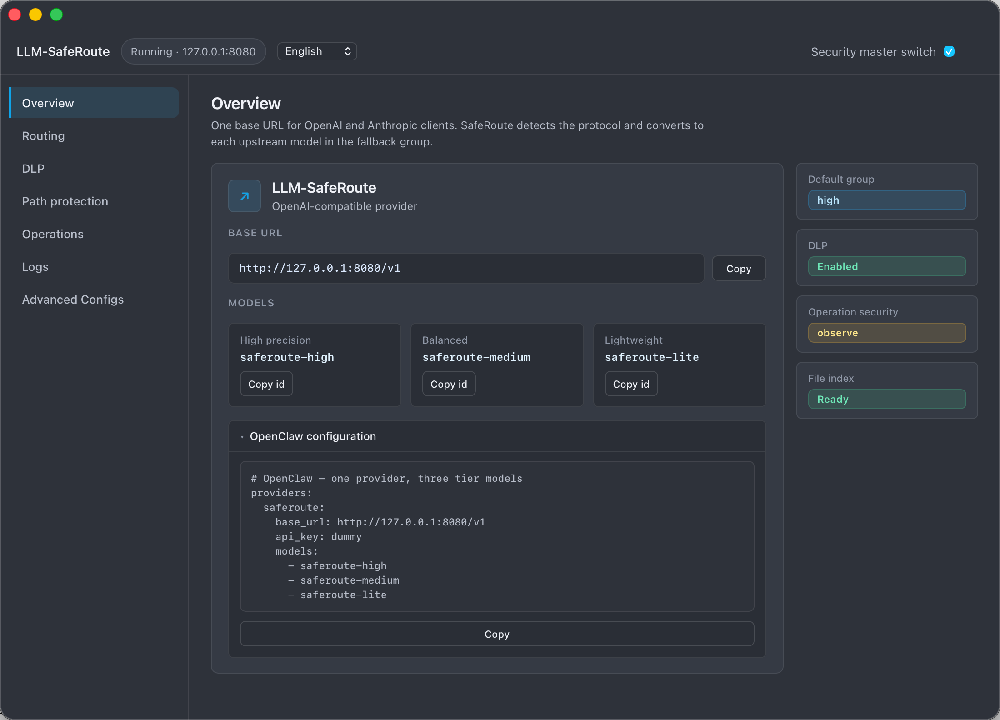
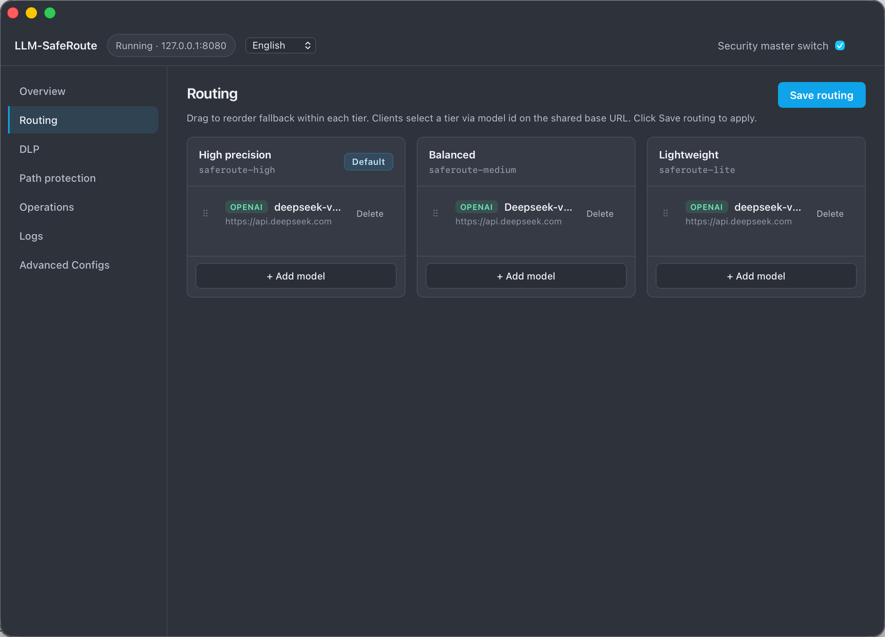
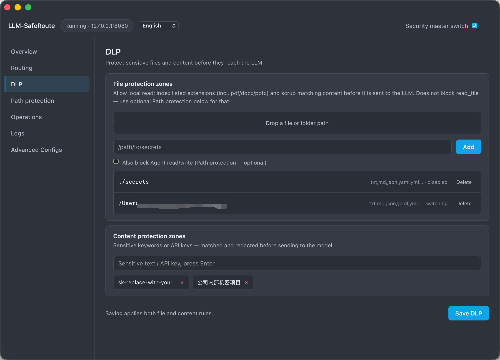
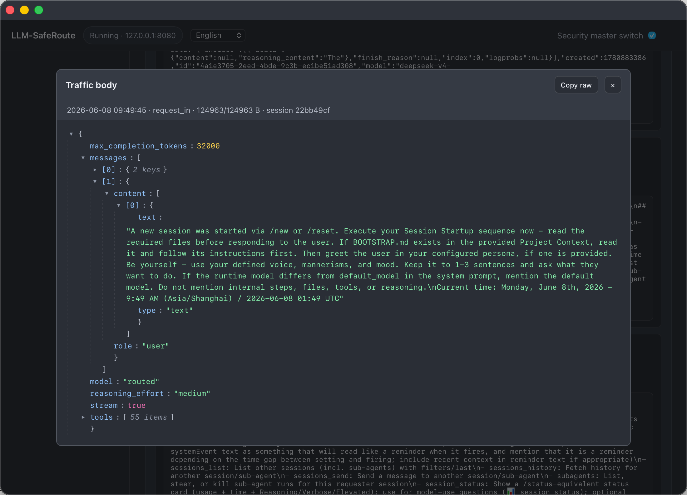

# LLM-SafeRoute

**A safe route to LLM intelligence—and a stable, faster path to get there.**

- LLM-SafeRoute is a lightweight local model proxy/router compatible with OpenAI and Anthropic client protocols.
- Point your IDE, agent, or SDK `base_url` at `http://127.0.0.1:8080/v1` to call multiple models safely and reliably—GPT, Claude Opus, Gemini, DeepSeek, GLM, Kimi, and more.
- No manual switching: on API failure, exhausted quota, or rate limits, fallback runs automatically with no interruption.
- Built-in safeguards: data-leak prevention, redaction, operation blocking, and file-path protection.
- Fulfills the basic needs of individual users for secure and reliable access to LLMs and agents.
- macOS and Windows desktop tray apps with one-click install.

**中文文档:** [README.zh-CN.md](README.zh-CN.md)

<a id="admin-ui-screenshots"></a>

<p align="center"><sub>Admin UI screenshots — click a title to flip · 1–4</sub></p>

<details open>
<summary><strong>1 / 4 · Overview</strong></summary>
<p align="center"></p>
</details>
<details>
<summary><strong>2 / 4 · Model routing</strong></summary>
<p align="center"></p>
</details>
<details>
<summary><strong>3 / 4 · DLP</strong></summary>
<p align="center"></p>
</details>
<details>
<summary><strong>4 / 4 · Traffic logs</strong></summary>
<p align="center"></p>
</details>

---

## Product positioning


|           |                                                                                                                                                                           |
| --------- | ------------------------------------------------------------------------------------------------------------------------------------------------------------------------- |
| **Route** | `high` / `medium` / `low` ordered fallback groups; auto-switch on upstream failure, malformed JSON, or missing first stream token; built-in OpenAI ↔ Anthropic conversion |
| **Fast**  | Rust core, local forwarding, native streaming; single config file, hot reload; optional tray app that stays out of your way                                               |
| **Safe**  | Content/file DLP, tool operation rules, path protection; master switch to enable or disable all security features                                                         |


> Change one line in your client config. Run one local process. A faster, more reliable path to the models you use.

---

## Quick start

```bash
chmod +x scripts/install.sh
./scripts/install.sh --all     # CLI + tray app + login autostart

securemodelroute               # start and open admin UI
```

**Windows:** run `SafeRoute_*_x64-setup.exe` (recommended), or `.\install.ps1 -All`, then `securemodelroute`

**Client config (provider mode — recommended, one universal base URL):**

```python
from openai import OpenAI
client = OpenAI(base_url="http://127.0.0.1:8080/v1", api_key="dummy")
# Pick a tier by model id (same provider, one base URL):
client.chat.completions.create(model="saferoute-high", messages=[...])
```

```python
# Anthropic SDK — same base URL; POST /messages (or /v1/messages)
import anthropic
client = anthropic.Anthropic(base_url="http://127.0.0.1:8080/v1", api_key="dummy")
client.messages.create(model="saferoute-high", max_tokens=1024, messages=[...])
```

LLM-SafeRoute detects the client protocol from headers and JSON body, then converts to each upstream model’s OpenAI or Anthropic API inside the selected fallback group.

Works like OpenClaw / Cursor **provider mode**: LLM-SafeRoute is one provider; high / medium / low fallback groups appear as three models. `GET /models` or `GET /v1/models` lists them.


| Item | Value |
| ---- | ----- |
| **Universal API base URL** | `http://127.0.0.1:8080/v1` |
| **OpenAI-style path** | `POST /chat/completions` (alias of `/v1/chat/completions`) |
| **Anthropic-style path** | `POST /messages` (alias of `/v1/messages`) |
| **Models** | `saferoute-high`, `saferoute-medium`, `saferoute-lite` |
| **Admin UI** | `http://127.0.0.1:8080/ui` |
| **Health** | `http://127.0.0.1:8080/health` |

Legacy tier path prefixes (`/high/messages`, `/medium/chat/completions`, …) and header `X-SMR-Fallback-Group` still work. Path/header override the `model` field when both are set. Session id: `X-SMR-Session-Id`.

---

## Downloads (desktop apps)

Pre-built packages are on [GitHub Releases](https://github.com/lowoodz/LLM-SafeRoute/releases/latest).

| Platform | Package | Install |
|----------|---------|---------|
| **macOS** (Apple Silicon) | `SafeRoute_*_aarch64.dmg` | Open the DMG, drag **SafeRoute.app** to Applications, launch from the menu bar tray |
| **macOS** (Apple Silicon) | `smr-*-darwin-arm64-app.tar.gz` | Extract `SafeRoute.app` to `/Applications` |
| **Windows** x86_64 | `SafeRoute_*_x64-setup.exe` | **Recommended:** run the NSIS installer — registers in **Settings → Apps**, installs tray GUI + `smr.exe` CLI, includes uninstaller |
| **Windows** x86_64 | `smr-*-windows-x86_64-app.zip` | Portable GUI + optional `*-setup.exe`; or extract and run `install.ps1 -All` |
| **Windows** x86_64 | `smr-*-windows-x86_64.zip` | CLI only: extract, run `install.ps1`, then `securemodelroute` |

Uninstall on Windows: **Settings → Apps → SafeRoute** (NSIS), or run `.\uninstall.ps1` to remove NSIS app and CLI companion files.

Build the NSIS installer on Windows: `.\scripts\package.ps1` (requires Node.js + Rust). From macOS with UTM: `./scripts/vm/package-windows-gui.sh`.

From source on macOS: `./scripts/install.sh --all` (CLI + tray + login autostart).  
From source on Windows: `.\install.ps1 -All` (zip layout) or use `SafeRoute_*_x64-setup.exe` (NSIS).

Config after install: `~/.local/etc/securemodelroute/smr.yaml` (macOS/Linux/Windows NSIS or `install.ps1`). Add upstream API keys in the admin UI or YAML—never commit secrets.

---

## OpenClaw

[OpenClaw](https://docs.openclaw.ai/) is an OpenAI-compatible agent gateway. Point it at LLM-SafeRoute so OpenClaw calls your local fallback router instead of vendor APIs directly.

**Prerequisites:** LLM-SafeRoute running (`securemodelroute` or the tray app). Configure upstream models and API keys in LLM-SafeRoute only (admin UI → **Routing** or `smr.yaml`). OpenClaw never needs real vendor keys.

**Provider mode (recommended):** LLM-SafeRoute is one OpenAI-compatible provider. Public model ids are the three fallback tiers — `saferoute-high`, `saferoute-medium`, `saferoute-lite` — not upstream names like `gpt-4o-mini`. Each id selects a fallback group; LLM-SafeRoute walks that group’s chain and handles OpenAI ↔ Anthropic conversion internally.

Edit `~/.openclaw/openclaw.json` (JSON5):

```json5
{
  models: {
    mode: "merge",
    providers: {
      saferoute: {
        baseUrl: "http://127.0.0.1:8080/v1",
        apiKey: "dummy",
        api: "openai-completions",
        models: [
          {
            id: "saferoute-high",
            name: "SafeRoute High",
            reasoning: false,
            input: ["text"],
            cost: { input: 0, output: 0, cacheRead: 0, cacheWrite: 0 },
            contextWindow: 128000,
            maxTokens: 8192,
          },
          {
            id: "saferoute-medium",
            name: "SafeRoute Medium",
            reasoning: false,
            input: ["text"],
            cost: { input: 0, output: 0, cacheRead: 0, cacheWrite: 0 },
            contextWindow: 128000,
            maxTokens: 8192,
          },
          {
            id: "saferoute-lite",
            name: "SafeRoute Lite",
            reasoning: false,
            input: ["text"],
            cost: { input: 0, output: 0, cacheRead: 0, cacheWrite: 0 },
            contextWindow: 128000,
            maxTokens: 8192,
          },
        ],
      },
    },
  },
  agents: {
    defaults: {
      model: { primary: "saferoute/saferoute-high" },
      models: {
        "saferoute/saferoute-high": { alias: "high" },
        "saferoute/saferoute-medium": { alias: "medium" },
        "saferoute/saferoute-lite": { alias: "lite" },
      },
    },
  },
}
```

Steps:

1. In LLM-SafeRoute admin UI → **Routing**, configure each tier’s upstream chain (OpenAI, Anthropic, DeepSeek, etc.).
2. In OpenClaw, register the three **public** ids above (`saferoute-high` / `medium` / `lite`) under `models.providers.saferoute.models`.
3. Add every `saferoute/<public-id>` you use to `agents.defaults.models` (OpenClaw allowlist). Switch tiers with `openclaw models set saferoute/saferoute-medium` or set `agents.defaults.model.primary`.
4. Restart the gateway: `openclaw gateway restart` (or restart the OpenClaw app).

Tip: admin UI → **Overview** → **OpenClaw configuration** lists the same base URL and model ids; use **Copy** there.

**Legacy alternatives** (when a client cannot set `model` to `saferoute-*`):

- Tier path prefix: `baseUrl: "http://127.0.0.1:8080/high/v1"` (also `/medium/v1`, `/lite/v1`)
- Header override: `headers: { "X-SMR-Fallback-Group": "high" }` on `http://127.0.0.1:8080/v1`

LLM-SafeRoute applies DLP, operation rules, and path protection to OpenClaw traffic the same as any other client.

---

## Features

### Model routing

- Three fallback tiers with drag-and-drop ordering in the admin UI
- Per-request group via URL path (`/high/v1`, `/medium/v1`, `/lite/v1`) or header override
- Streaming-aware fallback until the first content token
- Protocol detection and cross-vendor request/response mapping

### Data safety (DLP)

Redact sensitive data before it reaches the model, so secrets (private data) are not leaked through LLM calls.

- **Content rules** — full-text or fragment match for secrets, phrases, extensionless sensitive strings
- **Reversible tokens** — with `pipeline.dlp_reversible: true` (default), secrets are replaced by session tokens (`[[smr:…]]`) before they reach the model. **Only tool-call / tool-result fields are restored** on the response path; ordinary assistant text is not auto-restored. Per-session vault is capped at 4096 unique secrets (overflow falls back to irreversible redaction).
- **File rules** — disk-backed index (Bloom + SQLite + byte verify) for large corpora; incremental rebuild on file changes
- **SessionGuard** — when a tool mentions a protected file, redaction continues for the next *N* requests (`trigger_window`)
- Built-in credential presets (`sk-`, `AKIA`, `ghp_`, …) optional

### Operation safety

- Inspect tool-related fields on **requests and responses**
- `observe` (log only) or `enforce` (block)
- Rules by `command_exec`, `api_call`, `network_access` + keywords

### Path protection

- `deny_delete` / `deny_modify` / `deny_access` on paths; directories cover descendants

### Operations

- Web admin at `/ui` (English / 中文)
- Optional Tauri tray app (macOS / Windows)
- SQLite audit log and live security events
- Traffic body snapshots for debugging (optional, up to 20 MiB per file). Default saves **after DLP**; UI can switch to raw pre-DLP capture (may write secrets to disk).

Master switch: `pipeline.security_enabled` (also in the UI header).

---

## Configuration

Example: `[config/smr.example.yaml](config/smr.example.yaml)`

```yaml
server:
  listen: "127.0.0.1:8080"
  default_fallback_group: high

pipeline:
  security_enabled: true
  dlp_enabled: true
  dlp_reversible: true
  operation_security_mode: enforce

fallback_groups:
  high:
    - id: primary
      base_url: "https://api.openai.com/v1"
      model: "gpt-4o-mini"
      api_key_env: OPENAI_API_KEY
    - id: fallback
      base_url: "https://api.anthropic.com/v1"
      model: "claude-sonnet-4-20250514"
      protocol: anthropic
      api_key_env: ANTHROPIC_API_KEY
```

**Config paths**


| Platform                       | Typical location                         |
| ------------------------------ | ---------------------------------------- |
| macOS / Linux (install script) | `~/.local/etc/securemodelroute/smr.yaml` |
| macOS / Linux (direct `smr`)   | `~/.config/securemodelroute/smr.yaml`    |
| Windows                        | `%USERPROFILE%\.local\etc\securemodelroute\smr.yaml` |


Override with `SMR_CONFIG`. Prefer `api_key_env` over inline keys—never commit secrets.

**File DLP index:** `{config_dir}/file-index/{rule_id}/`

**Traffic snapshots (debug only):**

```yaml
logging:
  save_traffic_bodies: true
  traffic_request_capture: after_dlp   # after_dlp (default) | before_dlp (raw, may contain secrets)
  traffic_max_body_bytes: 20971520   # 20 MiB cap
```

Files: `{config_dir}/traffic/*.body`

---

## Admin UI

Open `http://127.0.0.1:8080/ui` — overview, routing, DLP, path rules, operation rules, logs, full YAML editor. Screenshots: see [Admin UI preview](#admin-ui-screenshots) above.


| API                              | Description                                     |
| -------------------------------- | ----------------------------------------------- |
| `GET /api/status`                | Listen address, security flags, index readiness |
| `GET/PUT /api/config`            | Read/write config; PUT hot-reloads              |
| `GET /api/traffic`               | Traffic snapshot list                           |
| `GET /api/traffic/{id}`          | Full snapshot body                              |
| `GET /api/events`, `/api/audits` | Events and audit rows                           |


---

## Development and testing

```bash
cargo test && ./scripts/verify.sh
cp config/test.env.example config/test.env   # gitignored; set SMR_GLM_API_KEY / SMR_DEEPSEEK_API_KEY
./scripts/run_all_tests.sh
```

Previous README snapshots: [docs/](docs/).

---

## License

MIT