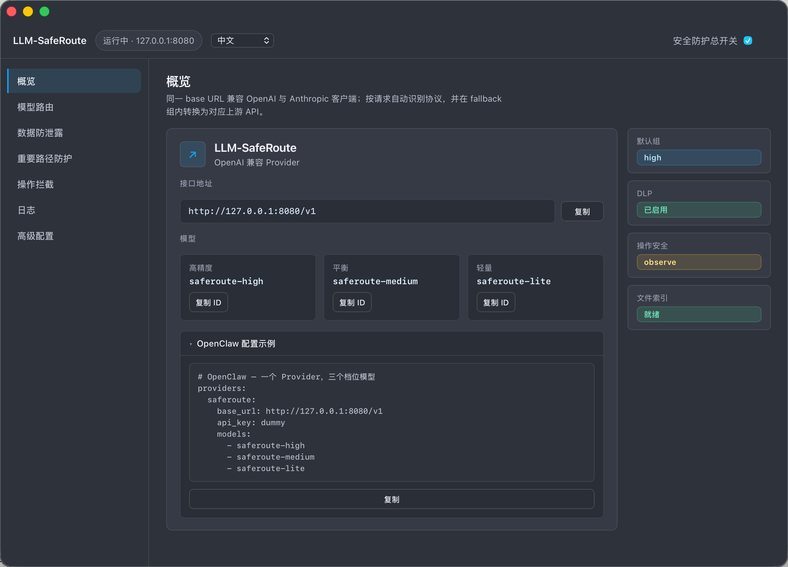
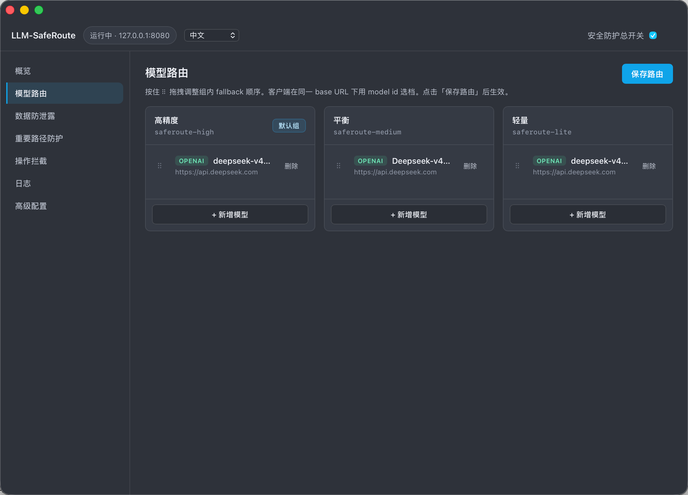
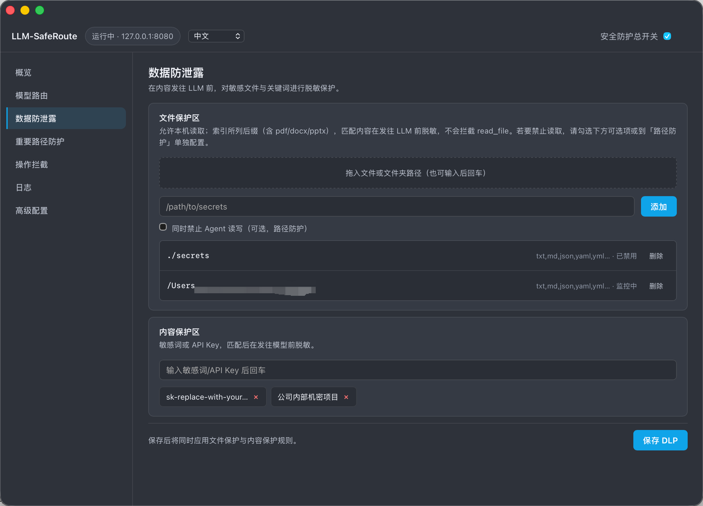
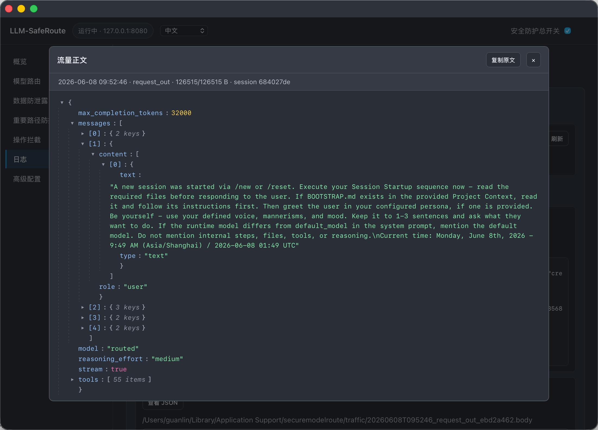

# LLM-SafeRoute

**通往大模型智能的安全之路——更快、更稳、更放心。**

- LLM-SafeRoute 是一款轻量本地模型代理/路由，兼容 OpenAI / Anthropic 客户端协议，
- 将 IDE、Agent 或 SDK 的 `base_url` 指向 `http://127.0.0.1:8080/v1`，即可安全、可靠地调用/访问多个大模型，例如 GPT、Claude Opus、Gemini、DeepSeek、GLM、Kimi等，
- 无需手动切换，API 调用失败、Token额度不足、频率限制时，自动Fallback/回退，全程无中断。
- 同时提供数据防泄漏、数据脱敏、操作拦截、文件路径防护等安全保障，
- 满足个人用户使用LLM和Agent时，对安全、可靠的基本需求，
- 支持 macOS、Windows 桌面托盘应用，一键安装。

**English:** [README.md](README.md)

<a id="admin-ui-screenshots"></a>

<p align="center"><sub>管理界面截图 — 点击标题翻页查看 · 1–4</sub></p>

<details open>
<summary><strong>1 / 4 · 概览</strong></summary>
<p align="center"></p>
</details>
<details>
<summary><strong>2 / 4 · 模型路由</strong></summary>
<p align="center"></p>
</details>
<details>
<summary><strong>3 / 4 · DLP</strong></summary>
<p align="center"></p>
</details>
<details>
<summary><strong>4 / 4 · 日志查看</strong></summary>
<p align="center"></p>
</details>

---

## 产品定位


| 维度            | 说明                                                                                              |
| ------------- | ----------------------------------------------------------------------------------------------- |
| **Route（路由）** | `high` / `medium` / `low` 三组有序 fallback；上游失败、畸形 JSON、流式未出首 token 时自动切换；内置 OpenAI ↔ Anthropic 转换 |
| **Fast（性能）**  | Rust 实现、本地转发、原生流式；单文件配置、热加载；可选托盘应用，常驻不占桌面                                                       |
| **Safe（安全）**  | 内容/文件 DLP、tool 操作拦截、重要路径防护；总开关一键启停                                                              |


> 客户端改一行地址，本地起一个进程，走更稳、更快的模型通路。

---

## 快速开始

```bash
chmod +x scripts/install.sh
./scripts/install.sh --all     # CLI + 托盘 + 登录自启

securemodelroute               # 启动并打开管理界面
```

**Windows：** 运行 `SafeRoute_*_x64-setup.exe`（推荐），或 `.\install.ps1 -All`，然后 `securemodelroute`

**客户端（Provider 模式 — 推荐，统一 base URL）：**

```python
from openai import OpenAI
client = OpenAI(base_url="http://127.0.0.1:8080/v1", api_key="dummy")
client.chat.completions.create(model="saferoute-high", messages=[...])
```

```python
# Anthropic SDK — 同一 base URL；POST /messages（或 /v1/messages）
import anthropic
client = anthropic.Anthropic(base_url="http://127.0.0.1:8080/v1", api_key="dummy")
client.messages.create(model="saferoute-high", max_tokens=1024, messages=[...])
```

LLM-SafeRoute 会根据请求头与 JSON 自动识别客户端协议，并在所选 fallback 组内转换为各上游模型的 OpenAI 或 Anthropic API。

与 OpenClaw、Cursor 等 **Provider 模式**一致：LLM-SafeRoute 是一个 Provider；高/中/低三档 fallback 组对应三个 model。`GET /models` 或 `GET /v1/models` 可列出它们。


| 项目 | 值 |
| ---- | --- |
| **统一 API base URL** | `http://127.0.0.1:8080/v1` |
| **OpenAI 路径** | `POST /chat/completions`（等同 `/v1/chat/completions`） |
| **Anthropic 路径** | `POST /messages`（等同 `/v1/messages`） |
| **模型** | `saferoute-high`、`saferoute-medium`、`saferoute-lite` |
| **管理界面** | `http://127.0.0.1:8080/ui` |
| **健康检查** | `http://127.0.0.1:8080/health` |

旧版档位路径前缀（如 `/high/messages`、`/medium/chat/completions`）与请求头 `X-SMR-Fallback-Group` 仍可用；若同时设置路径/请求头，其优先级高于 `model` 字段。`X-SMR-Session-Id` 用于 SessionGuard 与审计。

---

## 下载（桌面应用）

预编译包见 [GitHub Releases](https://github.com/lowoodz/LLM-SafeRoute/releases/latest)。

| 平台 | 安装包 | 安装方式 |
|------|--------|----------|
| **macOS**（Apple Silicon） | `SafeRoute_*_aarch64.dmg` | 打开 DMG，将 **SafeRoute.app** 拖入「应用程序」，从菜单栏托盘启动 |
| **macOS**（Apple Silicon） | `smr-*-darwin-arm64-app.tar.gz` | 解压后将 `SafeRoute.app` 放入 `/Applications` |
| **Windows** x86_64 | `SafeRoute_*_x64-setup.exe` | **推荐：** 运行 NSIS 安装程序 — 写入「设置 → 应用」，安装托盘 GUI + `smr.exe` CLI，含卸载程序 |
| **Windows** x86_64 | `smr-*-windows-x86_64-app.zip` | 便携 GUI + 可选 `*-setup.exe`；或解压后运行 `install.ps1 -All` |
| **Windows** x86_64 | `smr-*-windows-x86_64.zip` | 仅 CLI：解压后运行 `install.ps1`，再执行 `securemodelroute` |

Windows 卸载：**设置 → 应用 → SafeRoute**（NSIS），或运行 `.\uninstall.ps1` 移除 NSIS 应用与 CLI 伴生文件。

在 Windows 上构建 NSIS 安装包：`.\scripts\package.ps1`（需 Node.js + Rust）。macOS + UTM：`./scripts/vm/package-windows-gui.sh`。

源码安装：macOS 执行 `./scripts/install.sh --all`；Windows 使用 `SafeRoute_*_x64-setup.exe`（NSIS）或 zip 内 `.\install.ps1 -All`。

安装后配置文件：`~/.local/etc/securemodelroute/smr.yaml`（macOS/Linux/Windows NSIS 或 `install.ps1`）。在管理界面或 YAML 中填写上游 API Key，切勿提交到 Git。

---

## OpenClaw 配置

[OpenClaw](https://docs.openclaw.ai/) 是 OpenAI 兼容的 Agent 网关。将其指向本地 LLM-SafeRoute，即可由 LLM-SafeRoute 做 fallback 路由，并统一应用 DLP / 操作拦截 / 路径防护。

**前提：** LLM-SafeRoute 已启动（`securemodelroute` 或托盘应用）。上游模型与 API Key 仅在 LLM-SafeRoute 中配置（管理界面 → **路由**，或 `smr.yaml`）；OpenClaw 不需要真实厂商密钥。

**Provider 模式（推荐）：** LLM-SafeRoute 作为一个 OpenAI 兼容 Provider 暴露三个档位模型 — `saferoute-high`、`saferoute-medium`、`saferoute-lite` — **不是**上游名称（如 `gpt-4o-mini`）。每个 id 对应一组 fallback 链；组内自动切换，并由 LLM-SafeRoute 完成 OpenAI ↔ Anthropic 转换。

编辑 `~/.openclaw/openclaw.json`（JSON5）：

```json5
{
  models: {
    mode: "merge",
    providers: {
      saferoute: {
        baseUrl: "http://127.0.0.1:8080/v1",
        apiKey: "dummy",
        api: "openai-completions",
        models: [
          {
            id: "saferoute-high",
            name: "SafeRoute High",
            reasoning: false,
            input: ["text"],
            cost: { input: 0, output: 0, cacheRead: 0, cacheWrite: 0 },
            contextWindow: 128000,
            maxTokens: 8192,
          },
          {
            id: "saferoute-medium",
            name: "SafeRoute Medium",
            reasoning: false,
            input: ["text"],
            cost: { input: 0, output: 0, cacheRead: 0, cacheWrite: 0 },
            contextWindow: 128000,
            maxTokens: 8192,
          },
          {
            id: "saferoute-lite",
            name: "SafeRoute Lite",
            reasoning: false,
            input: ["text"],
            cost: { input: 0, output: 0, cacheRead: 0, cacheWrite: 0 },
            contextWindow: 128000,
            maxTokens: 8192,
          },
        ],
      },
    },
  },
  agents: {
    defaults: {
      model: { primary: "saferoute/saferoute-high" },
      models: {
        "saferoute/saferoute-high": { alias: "high" },
        "saferoute/saferoute-medium": { alias: "medium" },
        "saferoute/saferoute-lite": { alias: "lite" },
      },
    },
  },
}
```

步骤：

1. 在 LLM-SafeRoute 管理界面 → **路由** 中配置各档位的上游链（OpenAI、Anthropic、DeepSeek 等）。
2. 在 OpenClaw 的 `models.providers.saferoute.models` 中注册上述三个**公开** model id。
3. 在 `agents.defaults.models` 中登记每个要用的 `saferoute/<公开-id>`（OpenClaw 必填 allowlist）。切换档位可用 `openclaw models set saferoute/saferoute-medium`，或修改 `agents.defaults.model.primary`。
4. 重启网关：`openclaw gateway restart`（或重启 OpenClaw 应用）。

提示：管理界面 → **概览** → **OpenClaw 配置示例** 会列出相同的 base URL 与 model id，可直接 **复制**。

**旧版替代方式**（客户端无法设置 `model` 为 `saferoute-*` 时）：

- 档位路径前缀：`baseUrl: "http://127.0.0.1:8080/high/v1"`（亦可用 `/medium/v1`、`/lite/v1`）
- 请求头覆盖：在 `http://127.0.0.1:8080/v1` 上设置 `headers: { "X-SMR-Fallback-Group": "high" }`

OpenClaw 经 LLM-SafeRoute 发出的请求与 IDE、SDK 一样，都会走相同的安全策略。

---

## 功能

### 模型路由

- 三组 fallback，管理界面拖拽排序
- URL 路径（`/high/v1`、`/medium/v1`、`/lite/v1`）或请求头指定路由组
- 流式响应在首个 content token 前可 fallback
- 自动识别协议并做跨厂商映射

### 数据安全（DLP）

在模型访问/获取敏感数据前，自动脱敏，防止数据经模型泄露出去；

- **内容规则** — 全文/片段匹配密钥、短语及无后缀敏感串
- **可逆脱敏** — `pipeline.dlp_reversible: true`（默认）时，敏感内容在上游模型侧替换为会话 token（`[[smr:…]]`）。**仅 tool-call / tool-result 字段**在响应路径还原；普通 assistant 文本不会自动还原。每 session vault 最多 4096 条唯一 secret，超出后回退为不可逆脱敏。
- **文件规则** — 大语料磁盘索引（Bloom + SQLite + 字节校验），变更增量重建
- **SessionGuard** — tool 提及受保护文件后，后续 *N* 次请求持续脱敏（`trigger_window`）
- 可选内置凭证前缀模板（`sk-`、`AKIA`、`ghp_` 等）

### 操作安全

- 请求/响应侧 **tool 相关字段** 检查
- `observe` 仅记录 / `enforce` 拦截
- 按 command_exec、api_call、network_access + 关键字配置

### 路径防护

- `deny_delete` / `deny_modify` / `deny_access`；目录覆盖子路径

### 运维

- Web 管理 `/ui`（中/英）
- 可选 Tauri 托盘（macOS / Windows）
- SQLite 审计与实时事件
- 可选流量快照（调试，单文件最大 20 MiB）。默认保存 **DLP 之后**的请求体；UI 可切换为 DLP 前原始请求（可能写入明文密钥）。

总开关：`pipeline.security_enabled`（界面右上角）。

---

## 配置

示例：`[config/smr.example.yaml](config/smr.example.yaml)`

```yaml
server:
  listen: "127.0.0.1:8080"
  default_fallback_group: high

pipeline:
  security_enabled: true
  dlp_enabled: true
  dlp_reversible: true
  operation_security_mode: enforce

fallback_groups:
  high:
    - id: primary
      base_url: "https://api.openai.com/v1"
      model: "gpt-4o-mini"
      api_key_env: OPENAI_API_KEY
    - id: fallback
      base_url: "https://api.anthropic.com/v1"
      model: "claude-sonnet-4-20250514"
      protocol: anthropic
      api_key_env: ANTHROPIC_API_KEY
```

**配置路径**


| 平台                        | 常见位置                                     |
| ------------------------- | ---------------------------------------- |
| macOS / Linux（install 脚本） | `~/.local/etc/securemodelroute/smr.yaml` |
| macOS / Linux（直接 `smr`）   | `~/.config/securemodelroute/smr.yaml`    |
| Windows                   | `%USERPROFILE%\.local\etc\securemodelroute\smr.yaml` |


`SMR_CONFIG` 可覆盖路径。API Key 请用 `api_key_env`，勿提交明文。

**文件索引目录：** `{config_dir}/file-index/{rule_id}/`

**流量快照（仅调试）：**

```yaml
logging:
  save_traffic_bodies: true
  traffic_request_capture: after_dlp   # after_dlp（默认）| before_dlp（原始请求，可能含密钥）
  traffic_max_body_bytes: 20971520   # 20 MiB cap
```

文件位置：`{config_dir}/traffic/*.body`

---

## 管理界面

`http://127.0.0.1:8080/ui` — 概览、路由、DLP、路径、操作规则、日志、YAML 编辑。截图见上文 [管理界面预览](#admin-ui-screenshots)。

| API                             | 说明             |
| ------------------------------- | -------------- |
| `GET /api/status`               | 监听地址、安全开关、索引状态 |
| `GET/PUT /api/config`           | 读写配置；PUT 热加载   |
| `GET /api/traffic`              | 快照列表           |
| `GET /api/traffic/{id}`         | 完整快照内容         |
| `GET /api/events`、`/api/audits` | 事件与审计          |


---

## 开发与测试

```bash
cargo test && ./scripts/verify.sh
cp config/test.env.example config/test.env   # gitignored；填写 SMR_GLM_API_KEY / SMR_DEEPSEEK_API_KEY
./scripts/run_all_tests.sh
```

旧版 README 备份：[docs/](docs/)。

---

## 许可证

MIT